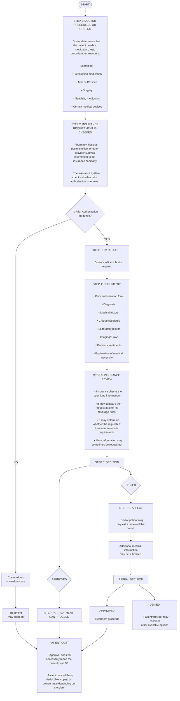

# Prior Authorization Process

```mermaid
flowchart TD

    START([START])

    S1["STEP 1: DOCTOR PRESCRIBES OR ORDERS<br/><br/>
    Doctor determines that the patient needs a medication, test, procedure, or treatment.<br/><br/>
    Examples:<br/>
    • Prescription medication<br/>
    • MRI or CT scan<br/>
    • Surgery<br/>
    • Specialty medication<br/>
    • Certain medical devices"]

    S2["STEP 2: INSURANCE REQUIREMENT IS CHECKED<br/><br/>
    Pharmacy, hospital, doctor's office, or other provider submits information to the insurance company.<br/><br/>
    The insurance system checks whether prior authorization is required."]

    DECISION{"Is Prior Authorization<br/>Required?"}

    NORMAL["Claim follows<br/>normal process"]

    TREATMENT1["Treatment<br/>may proceed"]

    S3["STEP 3: PA REQUEST<br/><br/>
    Doctor's office submits request."]

    S4["STEP 4: DOCUMENTS<br/><br/>
    • Prior authorization form<br/>
    • Diagnosis<br/>
    • Medical history<br/>
    • Chart/office notes<br/>
    • Laboratory results<br/>
    • Imaging/X-rays<br/>
    • Previous treatments<br/>
    • Explanation of medical necessity"]

    S5["STEP 5: INSURANCE REVIEW<br/><br/>
    • Insurance checks the submitted information.<br/>
    • It may compare the request against its coverage rules.<br/>
    • It may determine whether the requested treatment meets its requirements.<br/>
    • More information may sometimes be requested."]

    S6["STEP 6: DECISION"]

    APPROVED{"APPROVED"}
    DENIED{"DENIED"}

    S7A["STEP 7A: TREATMENT CAN PROCEED"]

    S7B["STEP 7B: APPEAL<br/><br/>
    Doctor/patient may request a review of the denial."]

    ADDITIONAL["Additional medical information<br/>may be submitted."]

    APPEAL["APPEAL DECISION"]

    A_APPROVED["APPROVED<br/><br/>Treatment proceeds"]

    A_DENIED["DENIED<br/><br/>
    Patient/provider may consider<br/>other available options"]

    COST["PATIENT COST<br/><br/>
    Approval does not necessarily mean the patient pays $0.<br/><br/>
    Patient may still have deductible, copay, or coinsurance depending on the plan."]


    START --> S1
    S1 --> S2
    S2 --> DECISION

    DECISION -->|NO| NORMAL
    NORMAL --> TREATMENT1
    TREATMENT1 --> COST

    DECISION -->|YES| S3
    S3 --> S4
    S4 --> S5
    S5 --> S6
    S6 --> APPROVED
    S6 --> DENIED

    APPROVED --> S7A
    S7A --> COST

    DENIED --> S7B
    S7B --> ADDITIONAL
    ADDITIONAL --> APPEAL

    APPEAL --> A_APPROVED
    APPEAL --> A_DENIED

    A_APPROVED --> COST
```
