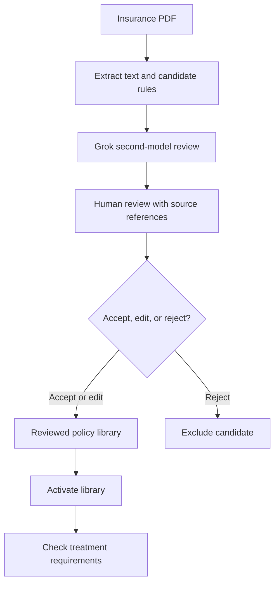
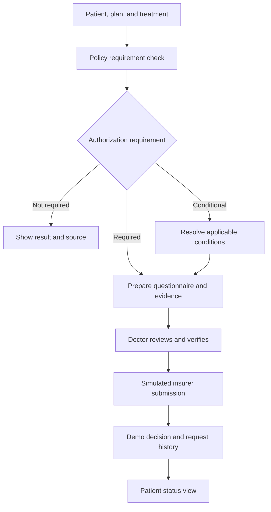
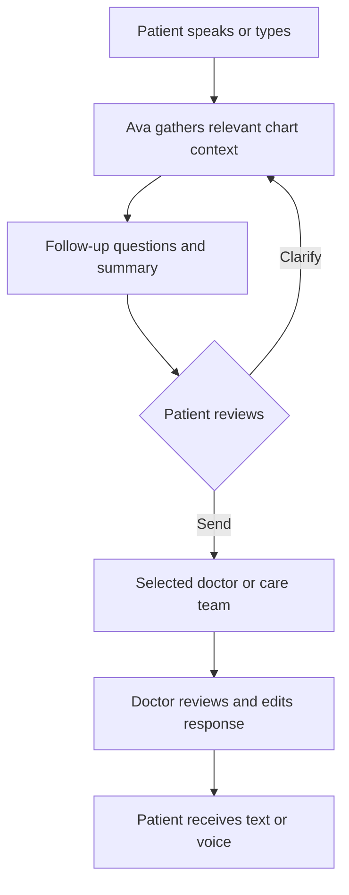
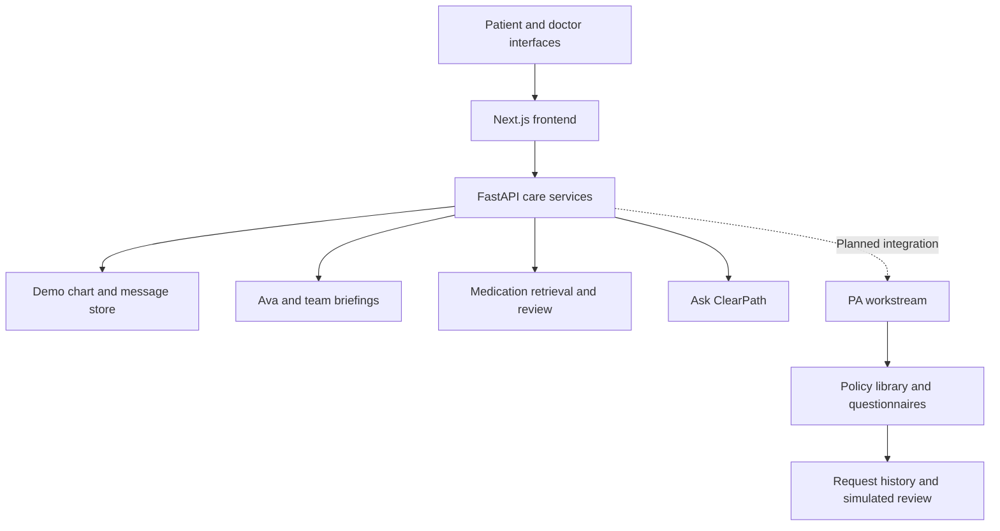

# ClearPath Health

**Clearer authorization. Connected care. A patient who stays part of the conversation.**

The doctor has a treatment plan. The patient hopes to get better. Then comes the question: **“What happens next?”**

ClearPath Health is an AI-powered healthcare prototype that makes prior authorization requirements easier to understand and brings patients and doctors together around shared care information. It combines a policy rules engine, guided documentation, and request tracking with a shared chart, care-team conversations, and Ava, our patient-facing assistant.

Built at **HackGT 13 · Georgia Tech · September 2026**.

**[Live shared-care demo](https://hack-gt-13.vercel.app/) · [Prior authorization workstream](https://github.com/poudelef/HackGT-13/tree/suman)**

> Prior authorization is our primary focus. Shared care supports the people and information behind a treatment request. These workstreams were developed separately; connecting them into one continuous workflow is our next integration milestone.

## Why we built it

A treatment request can leave several people trying to answer different questions:

- Does this insurance plan require prior authorization?
- What documentation is needed, and which doctor has it?
- Who owns the next step?
- How does the patient find out what is happening?

A patient can have several doctors and still feel alone coordinating their care. ClearPath helps make the requirements visible and gives the people involved a place to communicate.

## Prior authorization: from policy to a clearer next step

### A real policy foundation

Our initial policy dataset comes from the **253-page 2026 UnitedHealthcare Dual Complete OH-S3 (HMO-POS D-SNP) Evidence of Coverage**, an Ohio Medicare–Medicaid plan document.

We structured Chapter 4's Medical Benefits Chart and Chapter 3's general authorization information into **90 benefit categories**.

| Authorization requirement | Benefit categories |
|---|---:|
| Required | 41 |
| Not required | 41 |
| Conditional | 8 |
| **Total** | **90** |

Each category preserves source page references, coverage notes, and relevant conditions. A conditional result keeps distinctions such as diagnosis, site of service, and network status visible for review.

Representative CPT, HCPCS, and CDT codes help illustrate the categories. They are examples rather than exhaustive mappings: broad benefits such as equipment, laboratory testing, and Part B drugs span many codes.

An **authorization not required** result answers that specific question. Coverage, eligibility, and payment requirements still need to be considered.

### Policy ingestion and human validation

The upload workflow extracts text from an insurance PDF and organizes it into candidate rules. **Grok acts as a second-model reviewer**, flagging potential omissions or inconsistencies for a person to inspect. A reviewer accepts, edits, or rejects extracted items before activating the policy library.



Policy libraries support draft, live, and archived states with an audit trail. Activation can be reversed without repeating extraction. Questionnaire safeguards protect answers that have already been submitted.

### Guided documentation and request tracking

The doctor selects a patient, plan, and treatment. ClearPath checks the policy library, identifies the authorization requirement, and guides the doctor through supporting documentation when needed.



The intended review workflow supports approval, denial, and requests for additional information. The current PA demonstration uses a **simulated insurer approval**, rather than a live payer connection or a complete demonstration of every decision branch.

Actions are recorded in an append-only, timestamped request history. The patient status view uses the same request record, so its updates correspond to recorded workflow events.

### Example: preparing an MRI request

The PA workstream includes a lumbar MRI example using **CPT 72148**:

1. Check the selected policy and inspect the supporting requirements.
2. Review a request with **four of five documentation requirements met**.
3. Add the missing physical therapy note to complete the evidence.
4. Verify the answers and preview the submission.
5. Submit through the simulated insurer workflow and inspect the recorded result.

Documentation completeness and an insurer's decision are separate steps. The demo makes that distinction visible.

### FHIR-shaped data

The policy dataset is represented in JSON and a FHIR R4B bundle using `CoverageEligibilityResponse`, including `insurance.item.authorizationRequired`. Documentation uses `Questionnaire` and `QuestionnaireResponse` shapes.

The plan-level export contains placeholder patient and coverage references. It provides a foundation for interoperability work; it is not a live member eligibility response or a claim of certified payer integration.

## Shared care: bringing people together around the patient

### One shared chart and care-team room

The shared-care application brings together conditions, medicines, visit notes, treatment information, and conversations. Doctors can review the recorded context and discuss the patient in a team room.

AI-generated briefings focus on three practical questions:

- **Who owns the next step?**
- **What question is still open?**
- **What needs to happen next?**

Presence indicators show activity. The care-team graph makes relationships visible, and Insights brings handoffs and team updates into one view.

### Ava: a patient's words, a conversation with their team

Patients can speak or type to Ava, describe a concern, and answer follow-up questions. They review the resulting summary and choose whether to share it with one doctor or their care team.

Doctors receive organized context linked to the patient. They can draft an explanation in everyday language, review and edit it, and send text with an optional voice note.



### Medication information in context

Doctors can open a medication panel with openFDA label information, warnings, product details, adverse-event reports, and source links. **Explain to the patient with Ava** prepares a plain-language draft from retrieved label information for the doctor to review.

The prescription-review workflow considers recorded active medicines across prescribers and surfaces potential concerns for clinician assessment. NIH RxNav supports medication lookup and normalization; label information, explicit checks, and AI review support the broader workflow.

Starting, stopping, or changing a dose remains a decision for the clinician. Adverse-event reports do not establish causation or an individual patient's risk.

## Challenge alignment

| Track or challenge | What ClearPath demonstrates |
|---|---|
| **Meta: Bringing People Closer Together with AI** | Patient concerns become conversations with a chosen doctor or team; shared briefings and reviewed explanations help people understand one another and coordinate. |
| **Impiricus: Invent the Next Way We Engage HCPs** | A proposed engagement model built around clinicians' work: authorization requirements, medication information, patient explanations, and coordination with colleagues. |
| **AI/ML: Oracle of the Deep** | Policy extraction, second-model validation, conversational assistance, retrieved evidence, and structured summaries connected to explicit workflows. |
| **Best Use of Gemini API** | Ask ClearPath uses available application data and screen context to help users navigate information. |
| **ElevenLabs** | Spoken Ava replies and optional voice notes help patients receive information through conversation. |

### Meta: make the human connection visible

The central interaction is a complete exchange: **a patient expresses a concern, their care team receives it with context, and a reviewed response reaches the patient.**

AI helps organize everyday language and scattered updates into information another person can use. Muse Voice supports transcription, while Muse Spark supports care-team briefings. Patients choose what to share, and doctors remain responsible for their responses.

For a demonstration, show the message moving between patient and doctor accounts. That makes the connection tangible: someone asked, someone listened, and someone followed through.

### Impiricus: value within the clinician's workflow

ClearPath's proposed HCP engagement model begins with moving care forward. Policy requirements, medication information, patient explanations, and team discussions give a clinician a reason to return to the workspace.

Our next validation step is to measure documentation effort, request completeness, repeat use, and clinician feedback. The potential commercial value depends on demonstrating that this workflow helps healthcare professionals complete meaningful work.

### AI/ML: useful outputs with traceable inputs

Each AI component has a defined role. Policy rules retain sources, Grok flags concerns for human review, conversation summaries preserve patient context, and briefings identify next steps.

Evaluation priorities include extraction accuracy, summary fidelity, medication matching, response time, and whether users can identify and complete the next action.

## Technology and responsibilities

| Technology | Role in ClearPath |
|---|---|
| Next.js, React, TypeScript, Tailwind CSS | Application interface and shared-care views |
| FastAPI, Pydantic, Uvicorn, httpx | Backend APIs, typed data, and service integration |
| Policy rules engine | Authorization checks, conditions, and workflow transitions |
| PDF extraction and structured JSON | Turn policy text into reviewable candidate requirements |
| FHIR-shaped resources | Organize authorization and questionnaire data |
| Grok | Second-model review of extracted authorization rules |
| Meta Muse Spark | Care-team briefings and context organization |
| Meta Muse Voice | Audio transcription |
| OpenAI | Ava conversations, follow-up questions, summaries, message drafts, and medication-review assistance |
| Google Gemini | Ask ClearPath with application and screen context |
| ElevenLabs | Ava's spoken replies and optional voice notes when configured |
| openFDA | Medication labels, product information, and adverse-event reports |
| NIH RxNav | Medication lookup and normalization |
| React Flow | Care-team graph |
| Vercel | Shared-care application deployment |
| Cursor and Claude | Development and debugging assistance during the build |
| GitHub | Version control and collaboration |

Model output supports a reviewable next action. Explicit rules manage authorization requirements and workflow transitions, while people review the information and decisions that matter.

## Architecture

The shared-care application uses a Next.js frontend and FastAPI backend. Its demonstration store holds charts, messages, conversations, and notifications in memory.



An Ava voice turn combines transcription, relevant chart context, medication-label retrieval when needed, a generated reply, and speech playback. Sending the reviewed conversation creates a summary for the chosen recipient.

Medication caching, preloading, request deduplication, and timeouts help keep the experience responsive. Deployment capabilities and configured credentials determine which external services are active.

## Try the demo

Open the **[shared-care application](https://hack-gt-13.vercel.app/)**. Use separate browser sessions for patient and doctor accounts to demonstrate both sides of a conversation.

| Account | Role | Demo PIN |
|---|---|---|
| Patient 1 | Patient | `1001` |
| Patient 2 | Patient | `1002` |
| Patient 3 | Patient | `1003` |
| Doctor A | Family medicine | `1111` |
| Doctor B | Endocrinology | `2222` |
| Doctor C | Cardiology | `3333` |
| Doctor D | Nephrology | `4444` |

### Suggested walkthrough

1. Open a patient's shared chart as Doctor A and inspect the recorded care team and medicines.
2. Switch to Patient 1 and describe a concern to Ava.
3. Review the summary and share it with Doctor A or the team.
4. Return to the doctor view, open the incoming conversation, and inspect relevant medication information.
5. Review and send a patient-friendly response; show it arriving in the patient view.
6. Open the separate PA prototype and demonstrate policy review, the MRI documentation check, and simulated submission.

These accounts contain synthetic demonstration data.

## Shared-care project structure

```
backend/
  app/
    main.py                 FastAPI app, CORS, Vercel /api/backend prefix
    config.py               Settings from .env
    routers/api.py          All REST + WebSocket routes
    services/
      engine.py             CareEngine: charts, presence, Ava, Rx, FDA, insights
      store.py              In-memory store: patients, messages, calls, notifications
    engines/
      assistant.py          Ava conversation (patient + doctor modes)
      elevenlabs.py         Text-to-speech
      fda.py                openFDA labels, NDC, FAERS, medicine matching
      muse.py               Meta Muse Spark + Voice clients
      care_agent.py         Muse Spark tool loop: briefings, call/visit summaries
      gemini_copilot.py     Ask ClearPath
      rx_analysis.py        Prescription safety analysis
      drug_lookup.py        RxNav + openFDA helpers
      care_signals.py       Attention flags and handoffs
      connection_intel.py   Bond scores between doctors and patient
      graph.py              Care team graph
      patient_generator.py  Demo patients with a full care team
      auth.py               Demo accounts and tokens
    models/schemas.py       Pydantic models
  scripts/smoke.py          Smoke test
frontend/
  src/app/
    page.tsx                Landing page
    login/page.tsx          Sign in (patient / doctor)
    app/patients/           Doctor patient list + patient room
    app/me/                 Patient "My care"
    app/insights/           Insights (doctor + patient views)
  src/components/           AppShell, AssistantConversation, MedicineFdaCard,
                            PatientInsights, CareGraph, GlobalAsk, VoiceMessage, LiveStatusBadge
  src/lib/                  API client, auth, presence heartbeat, WAV recorder, types
vercel.json                 Routes /api/backend/* to FastAPI, everything else to Next.js
```

## Shared-care API overview

All routes are under `/api` (and `/api/backend/api` on Vercel). Interactive docs live at `/docs`.

| Area | Routes |
|---|---|
| Auth | `GET /auth/users` · `POST /auth/login` · `GET /auth/me` |
| Patients | `GET/POST /patients` · `GET /patients/{id}` · `POST /patients/{id}/messages` · `POST /patients/{id}/notes` · `POST /patients/{id}/visit` · `POST /patients/{id}/brief` · `POST /patients/{id}/summary` |
| Presence | `POST /presence/ping` · `POST /presence/leave` · `WS /ws/{patient_id}` |
| Ava | `POST /patients/{id}/assistant/turn` · `.../assistant/submit` · `.../assistant/send` · `POST /patients/{id}/office-call` · `POST /office-calls/{id}/responded` |
| Voice | `POST /patients/{id}/voice-message` · `GET /patients/{id}/voice-message/{audio_id}` |
| Medicines | `GET /fda/drug?name=&patient_id=` · `POST /patients/{id}/rx/analyze` · `POST /patients/{id}/rx` · `POST /patients/{id}/rx/{rx_id}/stop` |
| Insights | `GET /analytics` · `GET /activity` · `GET /handoffs` · `GET /notifications` · `POST /notifications/{id}/read` |
| Ask | `POST /ask` |
| Health | `GET /health` (shows which engines are enabled) |

---

## Run the shared-care application locally

**Backend** (Python 3.11+):

```bash
cd backend
pip install -r requirements.txt
cp .env.example .env        # then add any keys you have
python -m uvicorn app.main:app --reload --reload-dir app --port 8000
```

**Frontend** (use the Node.js version supported by the repository):

```bash
cd frontend
npm install
npm run dev                 # http://localhost:3000
```

### Environment variables (`backend/.env`)

Configure the services you want to demonstrate. The shared-care prototype includes fallback paths for unconfigured services; fallback output should be distinguished from an active model integration.

| Variable | Used for |
|---|---|
| `MODEL_API_KEY` | Meta Muse Spark + Voice ([dev.meta.ai](https://dev.meta.ai/)) |
| `GEMINI_API_KEY`, `GEMINI_MODEL` | Ask ClearPath; select an available model supported by your account |
| `OPENAI_API_KEY`, `OPENAI_MODEL` | Ava conversations + Rx review (default `gpt-4o-mini`) |
| `ELEVENLABS_API_KEY`, `ELEVENLABS_VOICE_ID`, `ELEVENLABS_MODEL` | Ava's voice (default Alice, `eleven_flash_v2_5`) |
| `CORS_ORIGINS` | Allowed frontend origins (default `http://localhost:3000`) |

The demo uses public openFDA and NIH RxNav endpoints. Keep API keys server-side and keep `.env` out of version control.

### Shared-care deployment

`vercel.json` deploys both services from one repo: requests to `/api/backend/*` go to FastAPI and everything else goes to Next.js. Add the same environment variables in the Vercel project settings.

## PA workstream configuration

The PA engine is maintained in the [suman branch](https://github.com/poudelef/HackGT-13/tree/suman). Follow that branch's setup instructions for its `pa-engine/` backend and `web/` frontend; the shared-care commands above apply to the `backend/` and `frontend/` layout.

For model-backed policy extraction, the PA workstream uses `OPENAI_API_KEY`. Its second-model reviewer can use `GROK_API_KEY` with `JUDGE_PROVIDER=grok`, or the supported Gemini configuration. Keep these credentials in the PA service's environment.

Without the required model configuration, the PA workstream can use a labeled fictional sample. Use the extracted UHC policy dataset when demonstrating the real-policy results described above.

## Challenges and lessons

- **Preserving policy meaning:** conditions and exceptions can appear across sections. Source references and conditional classifications keep rules reviewable.
- **Separating decisions:** authorization requirements, documentation completeness, and insurer approval answer different questions.
- **Making collaboration actionable:** briefings need an owner, an open question, and a next step.
- **Matching medication language:** brand names, ingredients, combination products, and patient descriptions need careful matching to the appropriate label.
- **Maintaining responsiveness:** we addressed blocking calls, duplicate Ava responses, and medication-preloading problems.
- **Integrating workstreams:** an isolated upload module kept the PA demonstration moving when a planned extraction branch could not be merged.

Our biggest learning: an AI output needs a useful destination. A summary should help a doctor respond. A briefing should help someone take ownership. An explanation should help a patient understand.

## Prototype scope

- **Policy coverage:** one real insurance plan has been structured into the initial 90-category dataset.
- **Billing codes:** examples represent benefit categories rather than a complete service-code rules library.
- **Insurer connection:** submission and decisions are simulated. The current PA demo shows an approval path.
- **Integration:** shared care and the PA engine are separate workstreams. Automatic assembly of PA requests from the shared chart is an integration goal.
- **Data:** patient records are synthetic, and the shared-care store resets on restart.
- **Voice:** ElevenLabs has been tested locally. The deployed application uses it when configured and otherwise supports browser speech fallback.
- **Clinical review:** AI-generated explanations and potential medication concerns support clinician review. They do not establish clinical safety or insurance coverage.
- **Interoperability:** FHIR-shaped exports are a starting point for further validation and integration.

## What's next

1. Connect the shared chart and PA engine: treatment request, evidence, policy check, documentation, review, and patient status.
2. Validate extracted rules and documentation workflows with domain experts.
3. Expand the policy library beyond the first insurance plan.
4. Replace in-memory demo storage with persistent storage.
5. Strengthen permission-based sharing and auditability.
6. Integrate real payer submission and response systems.
7. Evaluate request completeness, handoff clarity, and patient understanding with users.

**ClearPath Health: clearer authorization, connected care, and a patient who stays part of the conversation.**
