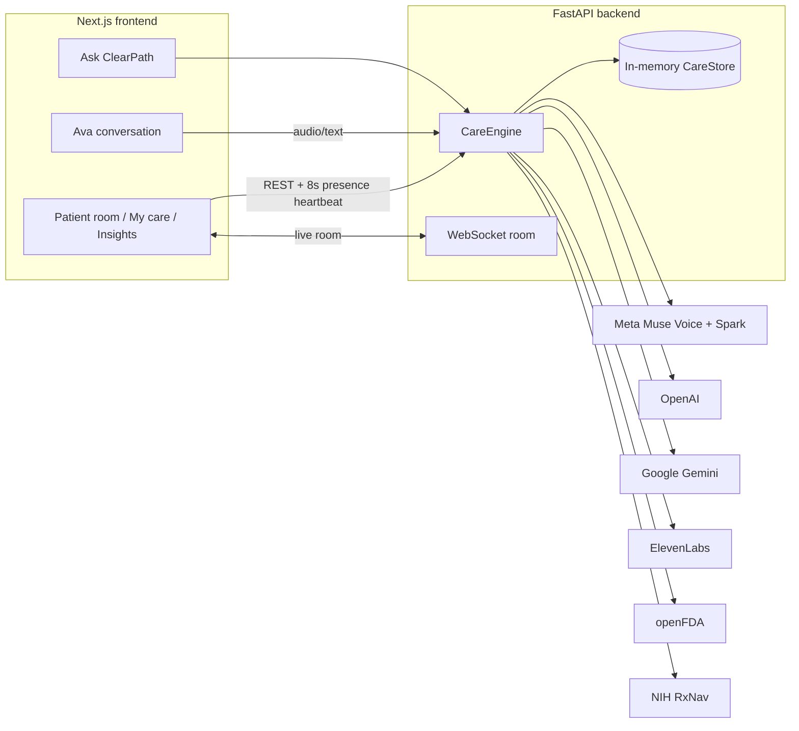

# ClearPath

**One shared care space for patients with more than one doctor.**

ClearPath puts a patient's whole care team (primary care, specialists, pharmacy) in the same chart, so nobody re-explains their story, prescriptions are checked against every doctor's list, and prior authorizations get built from the record instead of from faxes. Patients talk to **Ava**, a voice assistant, instead of waiting on hold.

**Live:** [hack-gt-13.vercel.app](https://hack-gt-13.vercel.app) · Built at **HackGT 13** (Georgia Tech, Sept 25–27, 2026)

---

## Tracks we're submitting to

| Track | Where it shows up in ClearPath |
|---|---|
| **Impiricus Challenge**: *Invent the next way we engage HCPs* | FDA medicine card for doctors, Ava drafting patient messages, prior auth from the chart |
| **Aramco**: presenting sponsor | Less manual work and fewer delays across the whole care process |
| **Best Use of Gemini API** | "Ask ClearPath": a helper on every screen that answers from live platform data |
| **ElevenLabs** | Ava's natural British voice for patients and for doctors' voice notes |
| **AI/ML Track** | Six AI and data services working together, each doing one clear job |

### Impiricus: a new way to engage HCPs

Impiricus's mission is to *ethically connect physicians to pharma resources, accelerating patient access to life-saving treatments.* ClearPath gives individual physicians, NPs and PAs new value right where they already work, in the patient chart:

- **Medicine facts from the FDA, one click from the chart.** Click any medicine on a patient's chart to open a card built from openFDA: boxed warning, what it treats, most common side effects, dosing, key warnings, interactions, what to tell the patient, real-world adverse-event reports (FAERS) with % serious, and every NDC product with brand/generic badges. It links straight to the DailyMed label.
- **"Explain to the patient with Ava."** From the same card, one button opens Ava in doctor mode, which drafts a plain-language explanation grounded in the FDA label. The doctor edits it and sends it as a message plus an optional voice note.
- **Prior authorization from the chart.** PA requests are assembled from the shared record: diagnosis, what's been tried, notes from other doctors, and urgency. That speeds up patient access to the treatment itself.
- **Safety check before prescribing.** Every new prescription is checked against everything the patient takes from every prescriber.
- Uses only free, nationally recognized datasets (**openFDA** labels, NDC and FAERS, plus **NIH RxNav**), as the challenge encourages.

### Aramco: efficiency where it matters

Healthcare loses days to process: faxes, phone tag, retyped histories, and prior authorizations stuck on paperwork. ClearPath goes after that directly:

- One chart every doctor updates, so there are no duplicated records between offices.
- Ava takes the patient's call, writes it up and routes it to the right doctor, which takes load off the front desk.
- PA requests pull their evidence automatically, and urgent cases are flagged first.
- A live Insights page shows totals, open handoffs and team activity, so nothing stalls unseen.

### Best Use of Gemini API

**Ask ClearPath** (the button in the corner of every page) is powered by **Google Gemini** (`gemini-3.8-flash`).

- Each page registers what's on screen (the chart snapshot, connections, reports, activity, handoffs), and Gemini gets that plus platform-wide context: all charts, insight totals and recent activity.
- It answers questions like *"Which patients need attention?"* or *"What is Patient 1 on?"* from live ClearPath data only. It never invents labs, meds or people, and it says where in the app to look when something is missing.
- A deterministic fallback answers from the chart if no key is set.

Code: [`backend/app/engines/gemini_copilot.py`](backend/app/engines/gemini_copilot.py), [`frontend/src/components/GlobalAsk.tsx`](frontend/src/components/GlobalAsk.tsx), [`frontend/src/lib/askScreen.tsx`](frontend/src/lib/askScreen.tsx)

### ElevenLabs

Ava speaks with **ElevenLabs** text-to-speech, using the `eleven_flash_v2_5` model and the voice "Alice" (British female).

- **For patients:** every Ava reply is spoken, so the conversation feels like a call, not a form.
- **For doctors:** when a doctor sends a message drafted with Ava, it can include an ElevenLabs voice note so the patient can listen instead of read.
- Low-latency flash model: the first greeting comes back in about 2 seconds.
- Falls back to an en-GB browser voice if no key is set.

Code: [`backend/app/engines/elevenlabs.py`](backend/app/engines/elevenlabs.py), [`frontend/src/components/AssistantConversation.tsx`](frontend/src/components/AssistantConversation.tsx)

### AI/ML Track

ClearPath uses AI where it removes real work, and each engine has one job:

| Engine | Job |
|---|---|
| **Meta Muse Voice** (`muse-voice-transcribe-1.0`) | Transcribes what patients say to Ava, doctors' voice messages and visit audio |
| **Meta Muse Spark** (`muse-spark-1.3`) | Tool-using care agent that reads the chart, room messages and team map, then writes the team briefing and posts tasks |
| **OpenAI** (`gpt-4o-mini`) | Runs Ava's conversations, and reviews each new prescription with RxNav/openFDA evidence |
| **Google Gemini** | "Ask ClearPath" across the whole platform |
| **ElevenLabs** | Ava's voice |
| **openFDA + NIH RxNav** | Ground truth for medicine facts, side effects and interactions |

Guardrails: Ava never tells a patient to start, stop or change a dose. She cites the FDA label, explains that adverse-event reports don't prove cause, and offers to pass questions to the doctor. Every AI feature has a non-AI fallback, so the app still works without keys.

---

## The problem

- **The MRI waits 18 days.** A cardiologist orders a stress MRI, staff fax prior history by hand, and by the time it's approved the chest pain is worse.
- **Two charts, two drug lists.** Cardiology adds a blood thinner, nephrology never sees it, and the patient fills both at different pharmacies.
- **Phone tag with the office.** A patient calls about a new symptom, it becomes a sticky note at the front desk, and the doctor sees it two days later.

## What ClearPath does

### For doctors
- **Patients list with live status:** who's active in the app right now, when they were last seen, and which doctors are currently in each chart.
- **Shared patient room:** overview, treatments, history, a live team room over WebSocket, the care team graph, and a Muse-written briefing (owner, open question, next step).
- **Prior authorization from the chart:** requests for medicines, tests, surgeries and procedures are filled in from the record.
- **Rx safety check:** analyze a new prescription against every active medicine from every prescriber (heuristics, NIH RxNav, openFDA labels, then an OpenAI review) before it's saved.
- **FDA medicine card:** click any medicine for its openFDA profile.
- **Ava for doctors:** draft a plain-language message for the patient, then send it with an optional voice note.
- **Voice messages:** record a message for the patient; Muse transcribes it.
- **Insights:** totals, open handoffs, per-patient bond scores and a filterable team activity feed (medicines, or notes and messages).
- **Notifications** for new Ava conversations, which disappear once read.

### For patients
- **My care:** conditions, medicines and plans in plain language, plus the care team with who's online now.
- **Talk to Ava:** speak or type. Ava asks follow-ups, then sends the conversation to the whole team or one chosen doctor, marked Urgent or Soon when needed.
- **Ask Ava about medicines:** answers come from the FDA label ("What are the side effects of my blood pressure pill?").
- **Insights:** a care-at-a-glance dashboard with notifications, visit notes, messages, lab results, care team, who prescribed what, care map and treatment plans.
- **Replies from doctors** as text plus a voice note.

## Demo accounts

| Account | Role | PIN |
|---|---|---|
| Patient 1 | Patient | `1001` |
| Patient 2 | Patient | `1002` |
| Patient 3 | Patient | `1003` |
| Doctor A | Family medicine | `1111` |
| Doctor B | Endocrinology | `2222` |
| Doctor C | Cardiology | `3333` |
| Doctor D | Nephrology | `4444` |

On the sign-in page, choose **I'm a patient** or **I'm a doctor**, then pick an account.

---

## How it works



**One Ava turn:** the browser records WAV, then **Muse Voice** transcribes it. The backend matches any medicine mentioned and pulls its **openFDA** label as reference. **OpenAI** writes Ava's reply and decides when the conversation is ready to send, **ElevenLabs** voices it, and the browser plays it back. When the patient sends it, the conversation becomes a structured call summary for the chosen doctor, and the doctor gets a notification.

**openFDA engine:** fetches the label, NDC products and FAERS reports in parallel. It picks the best single-ingredient label, strips section headings, cross-references and table debris, and caches results for 6 hours. A separate warm-up pool preloads a chart's medicines when it opens, with deduplication and timeouts.

## Tech stack

| Layer | Tech |
|---|---|
| Frontend | Next.js 15 (App Router), React 19, TypeScript, Tailwind CSS, React Flow (`@xyflow/react`) for the care map, Lucide icons |
| Backend | FastAPI, Pydantic v2, Uvicorn, httpx, WebSockets |
| AI / data | Meta Muse (Spark + Voice), OpenAI, Google Gemini, ElevenLabs, openFDA, NIH RxNav |
| Deploy | Vercel (multi-service: Next.js frontend + FastAPI backend under `/api/backend`) |

## Project structure

```
backend/
  app/
    main.py                 FastAPI app, CORS, Vercel /api/backend prefix
    config.py               Settings from .env
    routers/api.py          All REST + WebSocket routes
    services/
      engine.py             CareEngine: charts, presence, Ava, Rx, FDA, insights
      store.py              In-memory store: patients, messages, calls, notifications
    engines/
      assistant.py          Ava conversation (patient + doctor modes)
      elevenlabs.py         Text-to-speech
      fda.py                openFDA labels, NDC, FAERS, medicine matching
      muse.py               Meta Muse Spark + Voice clients
      care_agent.py         Muse Spark tool loop: briefings, call/visit summaries
      gemini_copilot.py     Ask ClearPath
      rx_analysis.py        Prescription safety analysis
      drug_lookup.py        RxNav + openFDA helpers
      care_signals.py       Attention flags and handoffs
      connection_intel.py   Bond scores between doctors and patient
      graph.py              Care team graph
      patient_generator.py  Demo patients with a full care team
      auth.py               Demo accounts and tokens
    models/schemas.py       Pydantic models
  scripts/smoke.py          Smoke test
frontend/
  src/app/
    page.tsx                Landing page
    login/page.tsx          Sign in (patient / doctor)
    app/patients/           Doctor patient list + patient room
    app/me/                 Patient "My care"
    app/insights/           Insights (doctor + patient views)
  src/components/           AppShell, AssistantConversation, MedicineFdaCard,
                            PatientInsights, CareGraph, GlobalAsk, VoiceMessage, LiveStatusBadge
  src/lib/                  API client, auth, presence heartbeat, WAV recorder, types
vercel.json                 Routes /api/backend/* to FastAPI, everything else to Next.js
```

## API overview

All routes are under `/api` (and `/api/backend/api` on Vercel). Interactive docs live at `/docs`.

| Area | Routes |
|---|---|
| Auth | `GET /auth/users` · `POST /auth/login` · `GET /auth/me` |
| Patients | `GET/POST /patients` · `GET /patients/{id}` · `POST /patients/{id}/messages` · `POST /patients/{id}/notes` · `POST /patients/{id}/visit` · `POST /patients/{id}/brief` · `POST /patients/{id}/summary` |
| Presence | `POST /presence/ping` · `POST /presence/leave` · `WS /ws/{patient_id}` |
| Ava | `POST /patients/{id}/assistant/turn` · `.../assistant/submit` · `.../assistant/send` · `POST /patients/{id}/office-call` · `POST /office-calls/{id}/responded` |
| Voice | `POST /patients/{id}/voice-message` · `GET /patients/{id}/voice-message/{audio_id}` |
| Medicines | `GET /fda/drug?name=&patient_id=` · `POST /patients/{id}/rx/analyze` · `POST /patients/{id}/rx` · `POST /patients/{id}/rx/{rx_id}/stop` |
| Insights | `GET /analytics` · `GET /activity` · `GET /handoffs` · `GET /notifications` · `POST /notifications/{id}/read` |
| Ask | `POST /ask` |
| Health | `GET /health` (shows which engines are enabled) |

---

## Run locally

**Backend** (Python 3.11+):

```bash
cd backend
pip install -r requirements.txt
cp .env.example .env        # then add any keys you have
python -m uvicorn app.main:app --reload --reload-dir app --port 8000
```

**Frontend** (Node 18+):

```bash
cd frontend
npm install
npm run dev                 # http://localhost:3000
```

### Environment variables (`backend/.env`)

Every key is optional. Without one, that feature falls back to heuristics, the chart, or the browser voice.

| Variable | Used for |
|---|---|
| `MODEL_API_KEY` | Meta Muse Spark + Voice ([dev.meta.ai](https://dev.meta.ai/)) |
| `GEMINI_API_KEY`, `GEMINI_MODEL` | Ask ClearPath (default `gemini-3.8-flash`) |
| `OPENAI_API_KEY`, `OPENAI_MODEL` | Ava conversations + Rx review (default `gpt-4o-mini`) |
| `ELEVENLABS_API_KEY`, `ELEVENLABS_VOICE_ID`, `ELEVENLABS_MODEL` | Ava's voice (default Alice, `eleven_flash_v2_5`) |
| `CORS_ORIGINS` | Allowed frontend origins (default `http://localhost:3000`) |

openFDA and NIH RxNav need no key. Never commit `.env`; it's gitignored.

### Deploy

`vercel.json` deploys both services from one repo: requests to `/api/backend/*` go to FastAPI and everything else goes to Next.js. Add the same environment variables in the Vercel project settings.

## Notes and limits

- Demo data only: patients and doctors are generated, and the store is in memory, so it resets on restart.
- The prior authorization flow on the landing page is an interactive walkthrough of how requests are built from the chart. The PA automation demo (Grok bot) is a separate piece, shown as its own button on the landing page.
- ClearPath shows FDA label information and reported side effects for education. It isn't medical advice, and Ava always refers dosing decisions to the care team.
