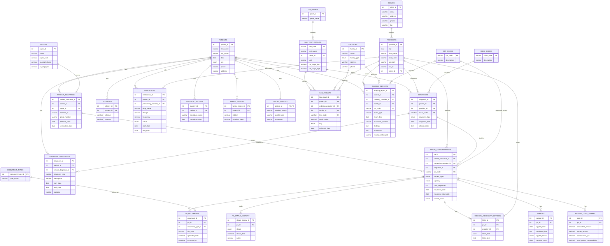

```mermaid
erDiagram

    PATIENTS {
        int patient_id PK
        varchar first_name
        varchar last_name
        date dob
        enum sex
        varchar phone
        varchar address
    }

    CLINICS {
        int clinic_id PK
        varchar name
        varchar address
        varchar phone
        varchar fax
    }

    PROVIDERS {
        int provider_id PK
        char npi
        varchar first_name
        varchar last_name
        varchar specialty
        varchar tax_id
        int clinic_id FK
    }

    FACILITIES {
        int facility_id PK
        varchar name
        enum facility_type
        varchar address
        varchar phone
    }

    PAYERS {
        int payer_id PK
        varchar name
        varchar payer_code
        varchar pa_dept_phone
        varchar pa_dept_fax
    }

    PATIENT_INSURANCE {
        int patient_insurance_id PK
        int patient_id FK
        int payer_id FK
        varchar member_id
        varchar group_number
        date effective_date
        date termination_date
    }

    ICD10_CODES {
        varchar icd10_code PK
        varchar description
    }

    CPT_CODES {
        varchar cpt_code PK
        varchar description
    }

    DOCUMENT_TYPES {
        int document_type_id PK
        varchar type_name
    }

    DIAGNOSES {
        int diagnosis_id PK
        int patient_id FK
        int provider_id FK
        varchar icd10_code FK
        enum diagnosis_type
        date diagnosis_date
        text clinical_notes
    }

    ALLERGIES {
        int allergy_id PK
        int patient_id FK
        varchar allergen
        varchar reaction
    }

    MEDICATIONS {
        int medication_id PK
        int patient_id FK
        int prescribing_provider_id FK
        varchar drug_name
        varchar dosage
        varchar frequency
        enum status
        date start_date
        date end_date
    }

    SURGICAL_HISTORY {
        int surgery_id PK
        int patient_id FK
        varchar procedure_name
        date procedure_date
    }

    FAMILY_HISTORY {
        int family_history_id PK
        int patient_id FK
        varchar relation
        varchar condition_desc
    }

    SOCIAL_HISTORY {
        int patient_id PK, FK
        varchar smoking_status
        varchar alcohol_use
        varchar occupation
    }

    LAB_PANELS {
        int panel_id PK
        varchar panel_name
    }

    LAB_TEST_CATALOG {
        varchar test_code PK
        varchar test_name
        int panel_id FK
        varchar unit
        decimal ref_range_low
        decimal ref_range_high
    }

    LAB_RESULTS {
        int lab_result_id PK
        int patient_id FK
        int ordering_provider_id FK
        int facility_id FK
        varchar test_code FK
        decimal result_value
        enum flag
        date collected_date
    }

    IMAGING_REPORTS {
        int imaging_report_id PK
        int patient_id FK
        int ordering_provider_id FK
        int facility_id FK
        varchar cpt_code FK
        varchar exam_type
        date exam_date
        varchar accession_number
        text findings
        text impression
        varchar reading_radiologist
    }

    PREVIOUS_TREATMENTS {
        int treatment_id PK
        int patient_id FK
        int related_diagnosis_id FK
        varchar treatment_type
        varchar description
        date start_date
        date end_date
        varchar outcome
    }

    PRIOR_AUTHORIZATIONS {
        int pa_id PK
        int patient_insurance_id FK
        int requesting_provider_id FK
        int diagnosis_id FK
        varchar cpt_code FK
        enum request_type
        enum urgency
        int units_requested
        date requested_date
        date requested_start_date
        enum current_status
    }

    PA_DOCUMENTS {
        int document_id PK
        int pa_id FK
        int document_type_id FK
        varchar file_path
        datetime uploaded_date
        datetime extracted_at
    }

    PA_STATUS_HISTORY {
        int status_history_id PK
        int pa_id FK
        enum status
        datetime status_date
        varchar notes
    }

    MEDICAL_NECESSITY_LETTERS {
        int letter_id PK
        int pa_id FK
        int provider_id FK
        date letter_date
        text letter_text
    }

    APPEALS {
        int appeal_id PK
        int pa_id FK
        date appeal_date
        text additional_info
        enum appeal_status
        date decision_date
    }

    PATIENT_COST_SHARES {
        int cost_id PK
        int pa_id FK
        decimal deductible_amount
        decimal copay_amount
        decimal coinsurance_pct
        decimal total_patient_responsibility
    }

    CLINICS ||--o{ PROVIDERS : employs
    PATIENTS ||--o{ PATIENT_INSURANCE : has
    PAYERS ||--o{ PATIENT_INSURANCE : covers

    PATIENTS ||--o{ DIAGNOSES : has
    PROVIDERS ||--o{ DIAGNOSES : diagnoses
    ICD10_CODES ||--o{ DIAGNOSES : classifies

    PATIENTS ||--o{ ALLERGIES : has
    PATIENTS ||--o{ MEDICATIONS : takes
    PROVIDERS ||--o{ MEDICATIONS : prescribes
    PATIENTS ||--o{ SURGICAL_HISTORY : has
    PATIENTS ||--o{ FAMILY_HISTORY : has
    PATIENTS ||--|| SOCIAL_HISTORY : has

    LAB_PANELS ||--o{ LAB_TEST_CATALOG : contains
    LAB_TEST_CATALOG ||--o{ LAB_RESULTS : defines
    PATIENTS ||--o{ LAB_RESULTS : has
    PROVIDERS ||--o{ LAB_RESULTS : orders
    FACILITIES ||--o{ LAB_RESULTS : performs

    PATIENTS ||--o{ IMAGING_REPORTS : has
    PROVIDERS ||--o{ IMAGING_REPORTS : orders
    FACILITIES ||--o{ IMAGING_REPORTS : performs
    CPT_CODES ||--o{ IMAGING_REPORTS : classifies

    PATIENTS ||--o{ PREVIOUS_TREATMENTS : has
    DIAGNOSES ||--o{ PREVIOUS_TREATMENTS : relates_to

    PATIENT_INSURANCE ||--o{ PRIOR_AUTHORIZATIONS : covers
    PROVIDERS ||--o{ PRIOR_AUTHORIZATIONS : requests
    DIAGNOSES ||--o{ PRIOR_AUTHORIZATIONS : justifies
    CPT_CODES ||--o{ PRIOR_AUTHORIZATIONS : requested_service

    PRIOR_AUTHORIZATIONS ||--o{ PA_DOCUMENTS : has
    DOCUMENT_TYPES ||--o{ PA_DOCUMENTS : categorizes
    PRIOR_AUTHORIZATIONS ||--o{ PA_STATUS_HISTORY : tracks
    PRIOR_AUTHORIZATIONS ||--o{ MEDICAL_NECESSITY_LETTERS : has
    PROVIDERS ||--o{ MEDICAL_NECESSITY_LETTERS : writes
    PRIOR_AUTHORIZATIONS ||--o{ APPEALS : has
    PRIOR_AUTHORIZATIONS ||--o{ PATIENT_COST_SHARES : has
```